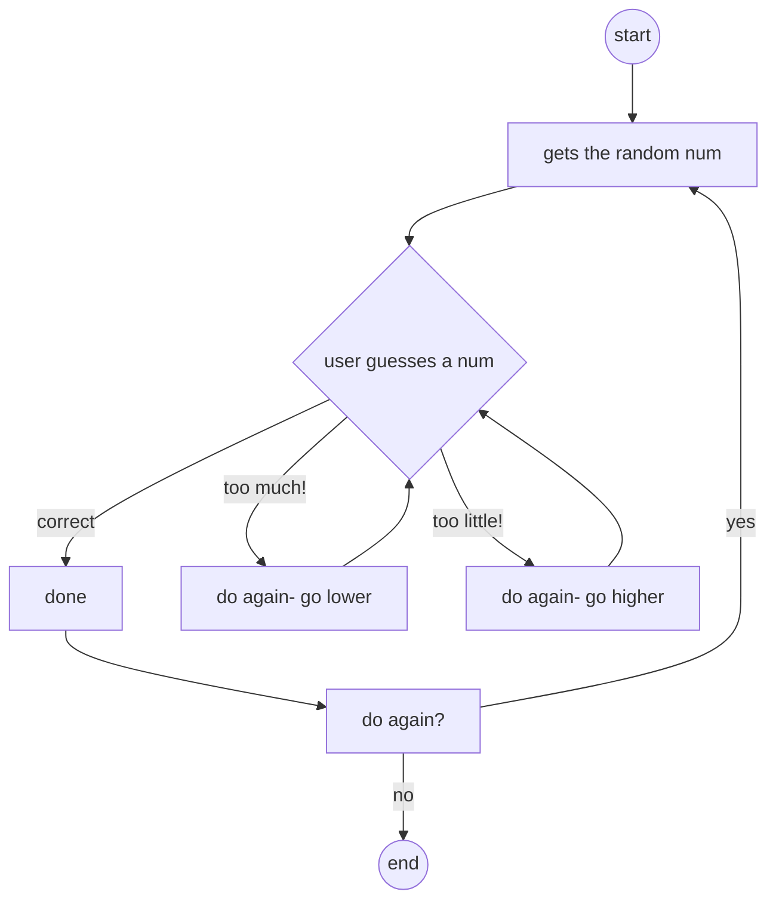

# The flowchart starts generating the random num then having the user input x number. If the user puts a num higher than the random num then it'll allow them to see it's too much as well as try again and vice versa if it's too little. Finally once guessed it'll allow the user to either try again or end the game.
